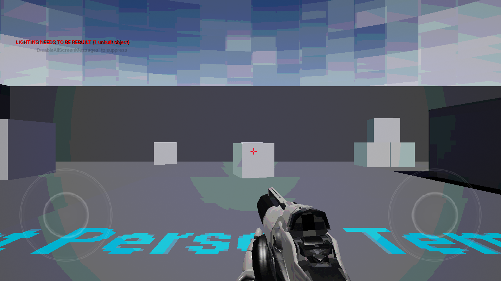
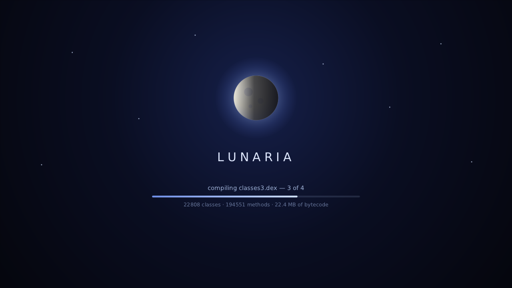
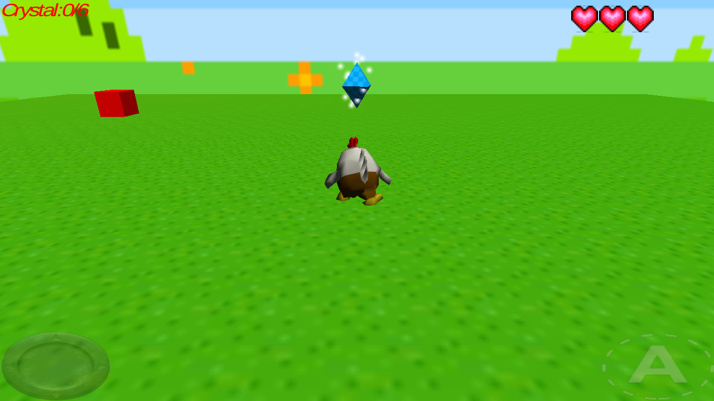
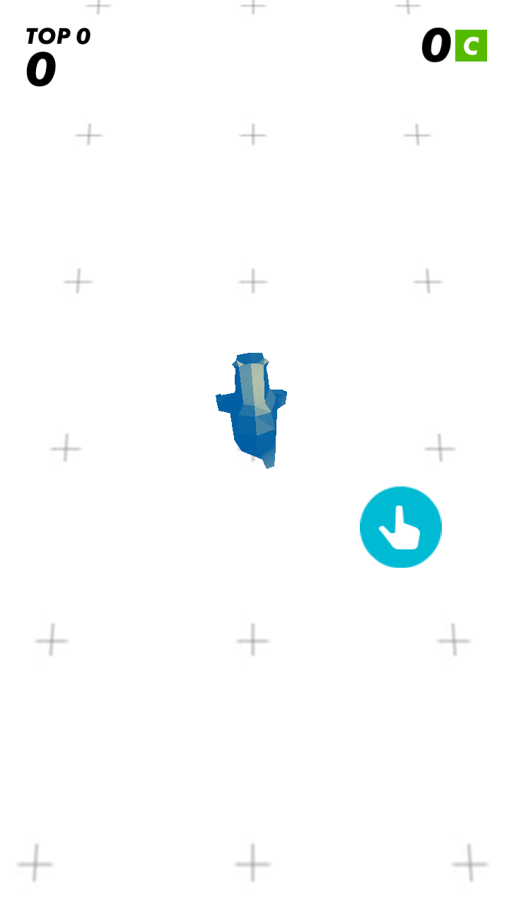

<!-- Hallmark · pre-emit critique: P5 H5 E4 S5 R4 V5 -->

# Lunaria

### Run Android game engines on Linux — without booting Android.

[](LICENSE)
[](#how-it-works)
[](#compatibility)
[](https://github.com/sponsors/yui0)

Lunaria is an experimental Android-to-Linux translation layer. It loads native
libraries from an APK or XAPK, executes ARM32/ARM64 code through
[dynarmic](https://github.com/merryhime/dynarmic), and bridges Android APIs,
JNI, EGL and OpenGL ES to the Linux host.

> [!IMPORTANT]
> Lunaria is a compatibility project under active development, not a complete
> Android emulator. Support varies by title and engine version.



<p align="center"><sub>UE4 FirstPersonExampleMap · armeabi-v7a · 1280×720 · Mesa llvmpipe</sub></p>

## Why Lunaria

| | What it means |
|---|---|
| **Two guest architectures** | ARMv7 and AArch64 execution through dynarmic JIT |
| **No Android system image** | Launch an `.apk` or `.xapk` directly from Linux |
| **Real graphics path** | EGL and OpenGL ES 3 calls pass through to the host |
| **Engine-aware bridges** | JNI, AssetManager, OBB, pthread, OpenSL ES and Android API stubs |
| **Headless-capable** | Falls back to a surfaceless EGL pbuffer when no X11 window is available |
| **A boot screen** | Shows what the emulator is loading instead of a black rectangle |
| **Built for diagnosis** | Frame capture, JIT profiling, SVC tracing and guest-memory watchpoints |

## Quick start

### 1. Install build dependencies

On Ubuntu or Debian:

```bash
sudo apt install \
  build-essential cmake libboost-dev libbsd-dev libunwind-dev \
  libglfw3-dev libegl1-mesa-dev libgles2-mesa-dev zlib1g-dev
```

### 2. Build

```bash
make dynarmic-build
make -j"$(nproc)"
```

The build fetches [luna-ui](https://github.com/Berry-OS/luna-ui) — the
header-only HTML/CSS engine the emulator's own UI and boot screen are drawn
with — into `luna-ui/` on first use. `make fetch-luna-ui` does it on its own.

### 3. Launch a package

```bash
./lunaria-apk.sh path/to/game.apk
./lunaria-apk.sh path/to/game.xapk
```

The launcher detects `arm64-v8a` or `armeabi-v7a`, finds the main native
library, prepares an installed-package view, and starts the runtime. For XAPK
files it reads `manifest.json`, keeps the base APK intact, and overlays the
split APK contents into that temporary view.

### While it loads

A large title spends a long time between the launcher's last message and its
first frame — Blade & Soul Revolution links a 200 MB library, runs 1,610 static
initialisers and compiles 28 MB of dex across four files before the engine
starts. Lunaria draws its own screen over that gap, so the wait shows what is
happening rather than a black rectangle:



<p align="center"><sub>Captured from the headless EGL framebuffer during a real
Blade &amp; Soul Revolution boot · the moon, its halo and its terminator are CSS
animations rendered by luna-ui</sub></p>

The screen comes down the moment the guest takes the surface. `LUNARIA_SPLASH=0`
turns it off, and `make splash-test` renders it on its own, without booting a
title.

Force a guest architecture when a package contains both:

```bash
LUNARIA_ARCH=armeabi-v7a ./lunaria-apk.sh game.apk
LUNARIA_ARCH=arm64-v8a  ./lunaria-apk.sh game.apk
```

## Compatibility

These are observed milestones, not a general compatibility guarantee.

| Title | Engine / ABI | Current result |
|---|---|---|
| **Between Two Worlds** | Unity 2023 IL2CPP · ARMv7 | Playable; reaches the main story scene |
| **Between Two Worlds** | Unity 2023 IL2CPP · AArch64 | Reaches language selection at about 70 fps on the recorded llvmpipe run |
| **FPSMobile** | Unreal Engine 4 · ARMv7 | FirstPersonExampleMap renders; 16,000+ swaps observed |
| **UnitySampleGame** | Unity · ARMv7 | Start screen accepts injected touch; playable 3D scene renders |
| **TIME LOCKER** | Unity · ARMv7 | Reaches the portrait tutorial gameplay scene |
| **Black Clover: Asta Fight** | Unity IL2CPP · AArch64 XAPK | Base + split load; Unity splash renders headlessly |
| **Blade & Soul Revolution** | Unreal Engine 4 · AArch64 | In-APK expansion mounts; the four dex files load, the SDK's audio-focus and account setup complete, and the engine reaches RHI, render thread and FBO setup; content streaming still stalls before the first frame |
| **Daggerfall Unity** | Unity Mono · ARMv7 | Mono runtime boots; rendering remains blocked |

<details>
<summary><strong>Run the open-source test titles</strong></summary>

### FPSMobile / Unreal Engine 4

Source: [Abhishrut/UnrealEngineAndroidSamples](https://github.com/Abhishrut/UnrealEngineAndroidSamples)

Place both files in `test/`; the launcher discovers a same-directory OBB
automatically.

```bash
curl -L -o test/FPSMobile-armv7.apk \
  "https://raw.githubusercontent.com/Abhishrut/UnrealEngineAndroidSamples/main/FPSMobile-armv7.apk"
curl -L -o test/main.1.com.YourCompany.FPSMobile.obb \
  "https://raw.githubusercontent.com/Abhishrut/UnrealEngineAndroidSamples/main/main.1.com.YourCompany.FPSMobile.obb"

LUNARIA_ARCH=armeabi-v7a ./lunaria-apk.sh test/FPSMobile-armv7.apk
```

### Between Two Worlds / Unity 2023 IL2CPP

Source: [ShutovKS/Between-two-worlds](https://github.com/ShutovKS/Between-two-worlds/releases/tag/1.0.5)

```bash
make fetch-btw

LUNARIA_ARCH=armeabi-v7a ./lunaria-apk.sh test/btw-android.apk
LUNARIA_ARCH=arm64-v8a  ./lunaria-apk.sh test/btw-android.apk
```

### Daggerfall Unity / Unity Mono

Source: [Vwing/daggerfall-unity-android](https://github.com/Vwing/daggerfall-unity-android/releases/tag/v1.1.1.8)

```bash
make fetch-libunity
./lunaria-apk.sh test/dfu-mono-32bit.apk
```

</details>

## More games, captured from Lunaria

These are gameplay frames read directly from Lunaria's headless EGL
framebuffer—not splash screens, phone captures, or Android emulator windows.

### UnitySampleGame · 3D gameplay

The launcher reaches the title screen, injects a touch on **Start**, and enters
the playable 3D scene with the character, crystal objective, health HUD, and
touch controls rendered at 1280×720.



### TIME LOCKER · tutorial gameplay

The portrait build advances beyond the Unity logo into the first interactive
scene. The player character, score HUD, playfield, and touch tutorial are
rendered at 720×1280.

<p align="center">
  
</p>

## Capture frames

Capture selected swap indices:

```bash
mkdir -p /tmp/lunaria-shots
LUNARIA_DUMP_DIR=/tmp/lunaria-shots \
LUNARIA_DUMP_FRAME=0,60,120 \
./lunaria-apk.sh game.apk
```

Or capture every *N* swaps:

```bash
LUNARIA_DUMP_DIR=/tmp/lunaria-shots \
LUNARIA_SCREENSHOT_EVERY=60 \
./lunaria-apk.sh game.xapk
```

Frames are written as PPM. Convert one with:

```bash
ffmpeg -i /tmp/lunaria-shots/lunaria_0001.ppm screenshot.png
```

## How it works

```text
 APK / XAPK
     │  extract base, splits, native libraries, assets and OBB
     ▼
 Android ELF loader ─── relocations and dependency resolution
     │
     ▼
 dynarmic JIT ───────── ARMv7 or AArch64 guest instructions
     │
     ├── SVC bridge ─── libc · pthread · filesystem · Android APIs
     ├── JNI bridge ─── classes · methods · AssetManager · services
     └── graphics ───── EGL · OpenGL ES 3 · host Mesa / GPU
```

- **ARM32:** a flat 4 GiB guest memory window with fastmem.
- **ARM64:** guest virtual addresses map one-to-one to host addresses; a
  high-address image window holds loaded ELFs, trampolines, JNI tables and
  stacks, enabling dynarmic fastmem.
- **Native calls:** guest libc, EGL, GLES and JNI calls cross generated
  `SVC #n` trampolines into host implementations.
- **Threads:** guest pthreads use cooperative round-robin scheduling with a
  separate JIT context per worker.
- **Assets:** `AssetManager` reads DEFLATE/STORE entries from APKs and OBB
  expansion files.

## Runtime controls

Common controls are listed here; the source contains additional narrow
diagnostic switches used during compatibility work.

| Variable | Default | Purpose |
|---|---:|---|
| `LUNARIA_ARCH` | auto | `armeabi-v7a` or `arm64-v8a` |
| `LUNARIA_WIDTH` / `LUNARIA_HEIGHT` | `1280` / `720` | Window or EGL surface size |
| `LUNARIA_PBUFFER` | auto fallback | Set `1` to skip GLFW and force headless EGL |
| `LUNARIA_MAX_FRAMES` | unlimited | Stop the render loop after *N* frames |
| `LUNARIA_MEM_TOTAL_MB` | `6144` | RAM reported to the guest |
| `LUNARIA_HEAP_MB` | `256` | Guest allocation heap size |
| `LUNARIA_THREAD_TICKS` | `200M` | ARM32 worker scheduling slice |
| `LUNARIA_A64_THREAD_TICKS` | `20K` | AArch64 worker scheduling slice |
| `LUNARIA_A64_FASTMEM` | `1` | Set `0` to route memory through callbacks |
| `LUNARIA_A64_CODE_CACHE_MB` | `128` | Per-JIT translated-code cache |
| `LUNARIA_DUMP_FRAME` | off | Comma-separated swap indices to capture |
| `LUNARIA_SCREENSHOT_EVERY` | off | Capture every *N* swaps |
| `LUNARIA_DUMP_DIR` | `/tmp` | Frame output directory |
| `LUNARIA_TRACE_SVC` | off | Trace guest-to-host SVC calls |
| `LUNARIA_A64_PCPROF` | off | Sample and report hot AArch64 guest PCs, per thread |
| `LUNARIA_A64_PCPROF_EVERY` | `20000` | Samples between profiler reports |
| `LUNARIA_SCHED_DUMP` | off | Dump every guest thread's state every *N* scheduler passes |
| `LUNARIA_SCHED_DUMP_STACK` | off | Add a return-address scan of each thread's stack to that dump |
| `LUNARIA_DUMP_LAST_SVC` | off | Print the recent SVC ring at shutdown |
| `LUNARIA_SPLASH` | `1` | Boot screen; set `0` to leave the surface untouched until the guest draws |
| `LUNARIA_DVM` | `1` | Dalvik bytecode emulator: `0` off, `1` run the APK's dex only where no host stub exists, `2` prefer the dex over host stubs |
| `LUNARIA_DVM_TRACE` | off | Log the methods the emulator declined (`[dvm] miss …`) |
| `LUNARIA_DEX_START` | on | Run the APK's Activity lifecycle from dex; set to `0` only to compare with the legacy hand-written startup sequence |

An APK with no engine entry point (no `ANativeActivity_onCreate`, no
`UnityPlayer.initJni`) is now started from its launcher Activity instead of
being rejected: `lunaria-apk.sh` reads it out of the manifest and passes it as
`ANDROID_LAUNCH_ACTIVITY`, and the loader runs its `onCreate`/`onStart`/
`onResume` through the bytecode VM.

Tick values accept `K`, `M`, and `G` suffixes, for example
`LUNARIA_ONLOAD_TICKS=5G`.

## Repository map

| Path | Role |
|---|---|
| `src/arm_exec.cpp` | dynarmic engines, SVC dispatch, JNI, EGL/GLES and threading |
| `src/dvm/` | Dalvik bytecode emulator: runs the APK's own Java from classes*.dex |
| `src/loader.c` | runtime entry point and Unity render-loop orchestration |
| `src/luna_overlay.c` | the emulator's own UI surface, drawn with luna-ui and composited over the guest frame |
| `src/luna_splash.c` | the boot screen: an animated CSS document with the loader's progress |
| `src/linker/` | Android ELF linker adapted for the host |
| `src/jvm/` | lightweight JVM/JNI object model and stubs |
| `src/lib/` | host implementations exposed to Android native code |
| `runtime/` | generated Android-compatible host shared libraries |
| `lunaria-apk.sh` | APK/XAPK inspection, extraction and launch pipeline |
| `PROGRESS.md` | detailed compatibility notes and current engineering work |

## Troubleshooting

<details>
<summary><strong>The game reports “project file not found”</strong></summary>

The title probably expects an OBB expansion file. Put it beside the APK using
its original name.

</details>

<details>
<summary><strong>A runtime stub library is missing</strong></summary>

Build the requested targets explicitly:

```bash
make runtime/libmediandk.so runtime/libGLESv3.so
```

</details>

<details>
<summary><strong>The screen is black or startup stalls</strong></summary>

Check the OBB/split files first, then collect a focused trace:

```bash
LUNARIA_TRACE_EXC=1 LUNARIA_DUMP_LAST_SVC=1 \
./lunaria-apk.sh game.apk 2>&1 | tee lunaria.log
```

</details>

<details>
<summary><strong>Rendering is slow</strong></summary>

Mesa llvmpipe is a software renderer and is useful for headless validation,
not performance testing. Use a GPU-accelerated host EGL/OpenGL stack for
real-time rendering.

</details>

## Project status

Lunaria is research software. Expect incomplete Android APIs, title-specific
issues, heavy diagnostic output, and breaking changes. Contributions are most
useful when they include the title, ABI, engine version, last successful
milestone, log, and a captured frame.

Licensed under the [Mozilla Public License 2.0](LICENSE).

Project Lunaria © 2026 Yuichiro Nakada.
