# Lunaria

### Run Android game engines on Linux — without booting Android.

[](LICENSE)
[](#how-it-works)
[](#compatibility)
[](https://github.com/sponsors/yui0)

Lunaria is an experimental Android-to-Linux translation layer. It loads native
libraries from an APK, XAPK or APKS, executes ARM32/ARM64 code through
[dynarmic](https://github.com/merryhime/dynarmic), and bridges Android APIs,
JNI, EGL, OpenGL ES and MediaCodec to the Linux host. The APK's own Java runs
through a built-in Dalvik bytecode emulator — no Android system image required.
`android.webkit.WebView` is drawn by a host browser over the Chrome DevTools
pipe: an installed Chrome or Chromium, or the built-in
[luna-browser](luna-browser/) (luna-ui and QuickJS).

> [!IMPORTANT]
> Lunaria is a compatibility project under active development, not a complete
> Android emulator. Support varies by title and engine version.

<p align="center">
  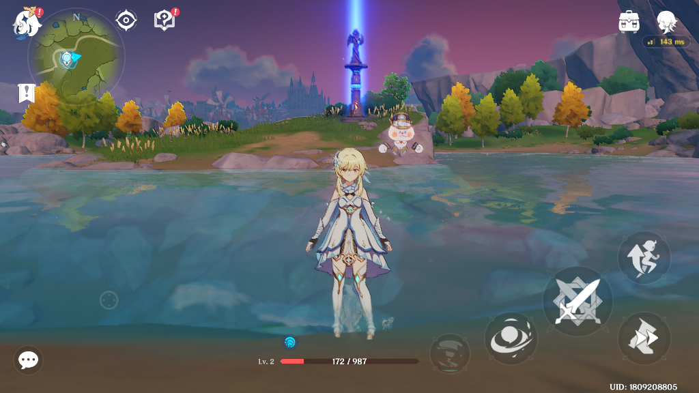
  &nbsp;
  
</p>

<p align="center">
  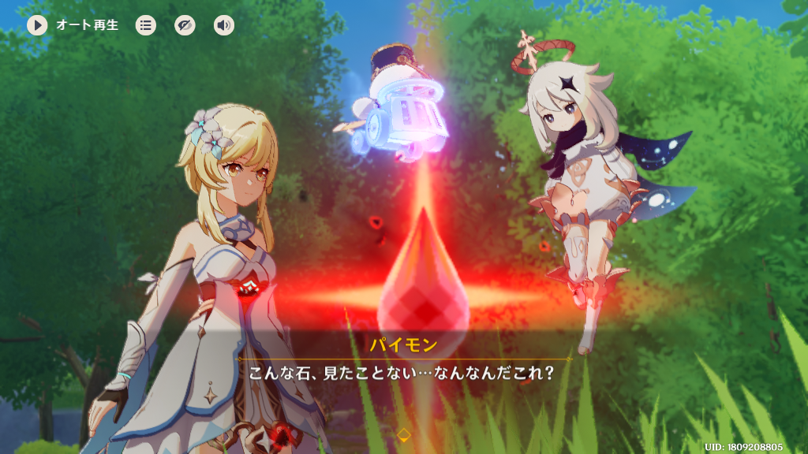
  &nbsp;
  
</p>

<p align="center"><sub>Genshin Impact 7.1.0 · Unity IL2CPP · arm64-v8a &nbsp;·&nbsp; Ni no Kuni: Cross Worlds · Unreal Engine 4 · arm64-v8a<br>Guest framebuffer on Linux. No APK patches.</sub></p>

## Why Lunaria

| | What it means |
|---|---|
| **Two guest architectures** | ARMv7 and AArch64 execution through dynarmic JIT |
| **No Android system image** | Launch an `.apk`, `.xapk` or `.apks` directly from Linux |
| **Real graphics path** | EGL and OpenGL ES 3 calls pass through to the host GPU. Vulkan is optional (`LUNARIA_VULKAN=1`) and still secondary to GLES |
| **Engine-aware bridges** | JNI, AssetManager, OBB, pthread, OpenSL ES and Android API stubs |
| **Dalvik on the host** | APK `classes*.dex` run in `src/dvm/` when no host stub exists |
| **MediaCodec path** | H.264 via openh264, AAC via libavcodec — intro movies can finish |
| **WebView on the host** | Chrome/Chromium or luna-browser, same DevTools pipe, composited into the view |
| **A named device** | `lunaria.conf` reports a real retail profile (Pixel 6 by default) |
| **Parallel AArch64** | `LUNARIA_A64_ENGINES>1` runs guest workers on host threads |
| **Keyboard on a touch HUD** | Bundled maps for Genshin and Cross Worlds; WASD, skills, mouse-look together |
| **Headless-capable** | Falls back to a surfaceless EGL pbuffer when no X11 window is available |
| **Built for diagnosis** | Frame capture, JIT profiling, SVC tracing and guest-memory watchpoints |

## Gallery

These frames are read from Lunaria's guest framebuffer (GLFW window or headless
EGL) — not phone captures or Android emulator windows.

### Genshin Impact 7.1.0

Unity IL2CPP on arm64-v8a, framebuffer **1024×576**. The current run goes
past the HoYoverse splash, login and server select, through shader compile
and the resource download, then past **TAP TO BEGIN** into the world and the
prologue: the shore outside Mondstadt, and the cutscene with Paimon.
Characters and scenery in these frames are drawn in color.

Earlier shore captures (`screenshot_genshin_field.png`,
`screenshot_genshin_swim.png`, `screenshot_genshin_chat.png`) still show the
Traveler as a blue silhouette. Login-scene column materials are still being
checked. Walking input and long sessions are still open.

<p align="center">
  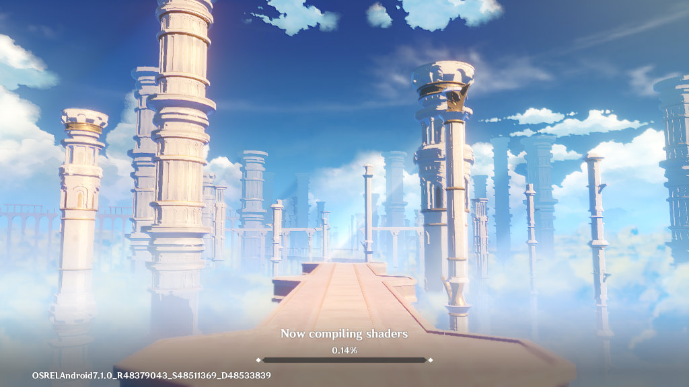
  &nbsp;
  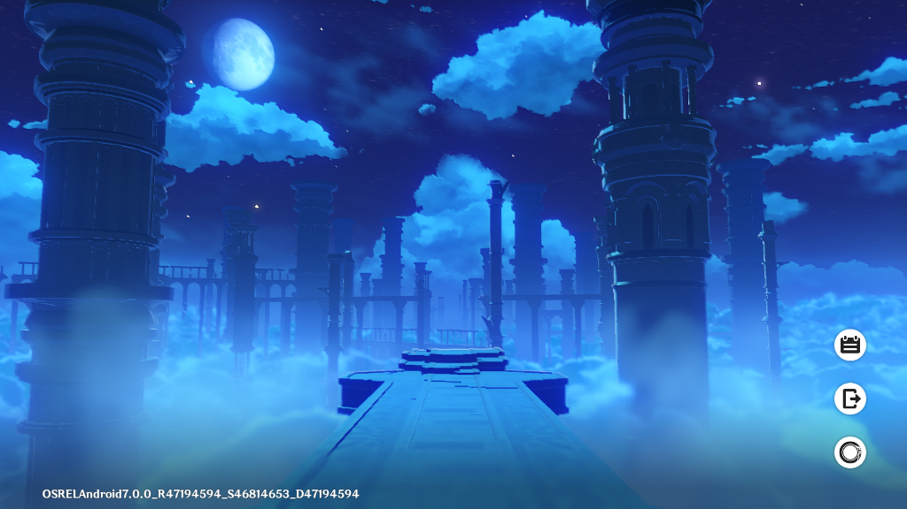
</p>

<p align="center">
  
  &nbsp;
  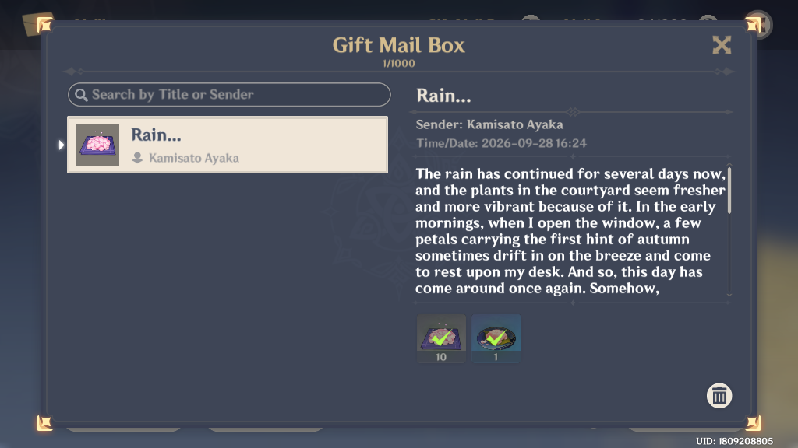
</p>

<p align="center">
  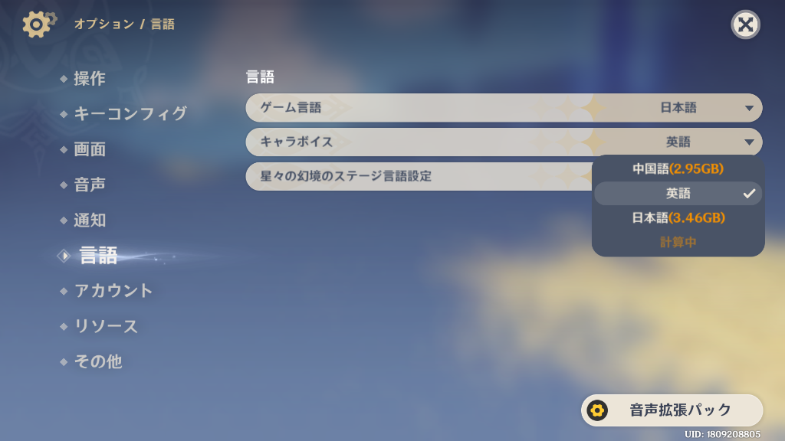
</p>

<p align="center"><sub>Shader compile · login · server · mailbox · language</sub></p>

The same boot also left the in-between frames: shader progress
(`screenshot_genshin_compile.png`, `screenshot_genshin_compile_early.png`),
data load (`screenshot_genshin_loading.png`), **TAP TO BEGIN**
(`screenshot_genshin_begin.png`), the element splash
(`screenshot_genshin_elements.png`) and the HoYoverse card
(`screenshot_genshin_splash.png`).

### Ni no Kuni: Cross Worlds

A commercial UE4 title on arm64-v8a. Guest login, server select, character
select, the starting village, story dialogue, a voiced cutscene, then
in-world play. No APK or guest patches — emulator-side fixes only.
Programmatic taps use `LUNARIA_TOUCH_TEST`. A bare `x,y` is a percentage of
the framebuffer (`50,84` and `50%,84%` are the same point); `640px,606px` is
a guest pixel. `xdotool` synthetic clicks are ignored by GLFW. Framebuffer
is **1024×576**.

<p align="center">
  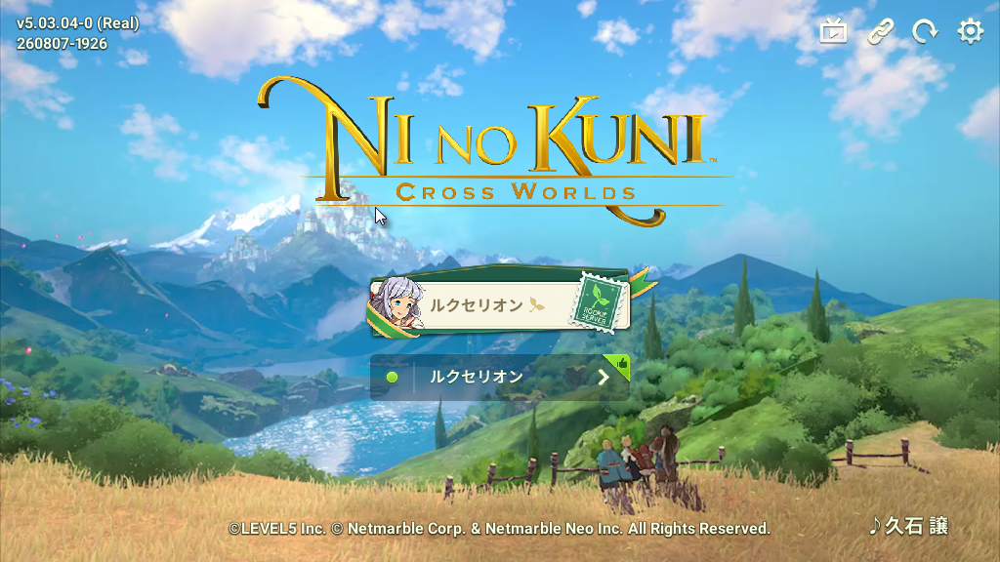
  &nbsp;
  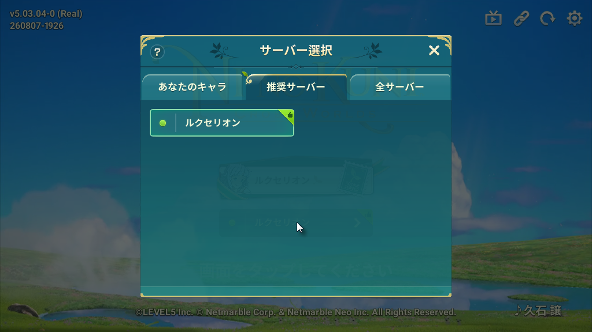
</p>

<p align="center">
  
  &nbsp;
  
</p>

<p align="center">
  
  &nbsp;
  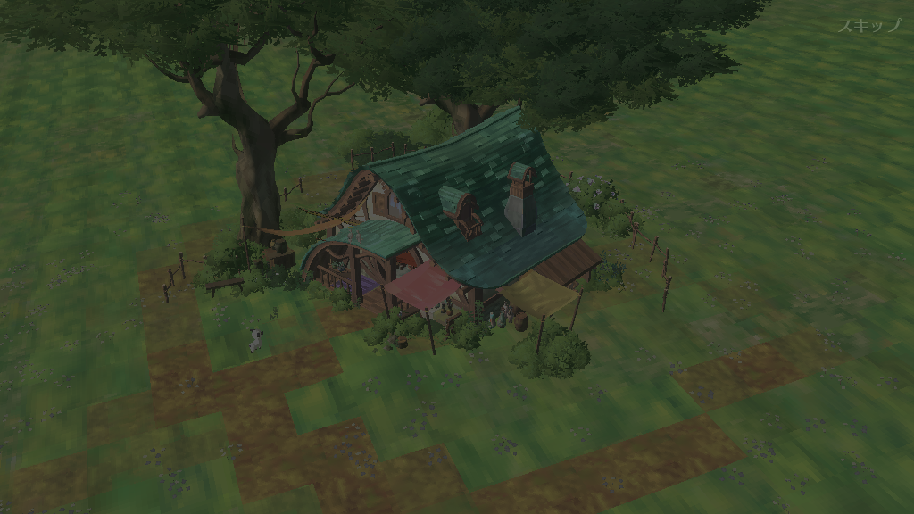
</p>

<p align="center">
  
  &nbsp;
  
</p>

<p align="center">
  
  &nbsp;
  
</p>

<p align="center"><sub>Title · server · account · character select · village · in-world · Chloe · Evermore · intro · the client's own rest screen</sub></p>

### Open-source and smaller titles

<p align="center">
  
  &nbsp;
  
</p>

<p align="center"><sub>Between Two Worlds · Unity 2023 IL2CPP · 1280×720 &nbsp;·&nbsp; FPSMobile · UE4 · armeabi-v7a · Mesa llvmpipe</sub></p>

<p align="center">
  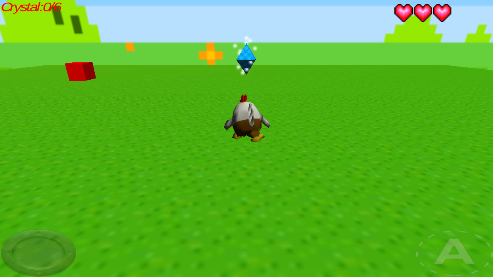
  &nbsp;
  
</p>

<p align="center"><sub>UnitySampleGame, an earlier 1280×720 run that reached the playable scene &nbsp;·&nbsp; TIME LOCKER tutorial, 720×1280</sub></p>

<p align="center">
  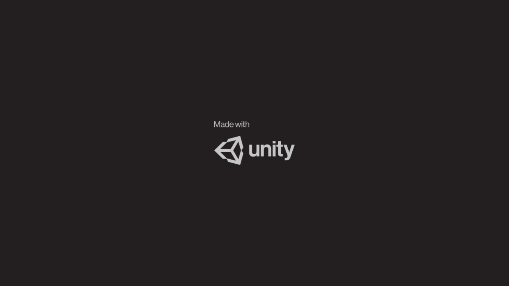
</p>

<p align="center"><sub>Black Clover: Asta Fight · Unity splash, headless</sub></p>

### Lunaria itself

A large title spends a long time linking, translating and compiling dex
before the first guest frame. The boot card is Lunaria's own surface for
that wait. Once the guest draws, right-click opens the host menu over the
frame: screenshot (also F12), paste-on-type, Back, volume and mute, ALSA
output, keyboard map, WebView zoom and engine, reload, full screen, quit.

<p align="center">
  
  &nbsp;
  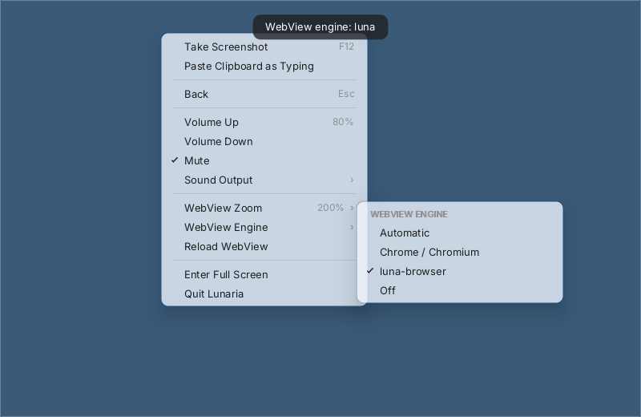
</p>

<p align="center"><sub>Boot card · host menu, WebView engine set to luna-browser, zoom 200%, mute on</sub></p>

## Quick start

### 1. Install build dependencies

On Ubuntu or Debian:

```bash
sudo apt install \
  build-essential cmake pkg-config \
  libboost-dev libbsd-dev libunwind-dev \
  libglfw3-dev libegl1-mesa-dev libgles2-mesa-dev \
  libssl-dev libicu-dev zlib1g-dev \
  libasound2-dev libvulkan-dev
```

`libvulkan-dev` supplies the headers for the bridge. The bridge stays off
until `LUNARIA_VULKAN=1`, and then it `dlopen`s the host's `libvulkan.so.1`.

### 2. Build

```bash
make dynarmic-build
make x86_64 -j"$(nproc)"   # host is x86_64; plain `make` builds the 32-bit x86 ABI
```

`make` / `make x86_64` already pulls Cisco's openh264 shared library into
`runtime/` (required for MediaCodec H.264). Re-run explicitly with
`make fetch-openh264` if you need to refresh it.

`make syslib` fills `syslib-arm64/` with an AArch64 libm, a bionic libc, and
libz. The launcher points `LUNARIA_SYSLIB_DIR` at that directory when it
exists, so pure arithmetic (`pow`, `sincosf`) and inflate stay inside the
guest. `make guestlib` builds `liblunaria_guest.so` from `src/lib/guest.c`
(a zero-duration `nanosleep` returns without leaving the JIT).

### 3. Launch a package

```bash
./lunaria-apk.sh path/to/game.apk
./lunaria-apk.sh path/to/game.xapk
./lunaria-apk.sh path/to/game.apks
LUNARIA_ALSA_DEVICE="hw:7,0" ./lunaria-apk.sh Cross+Worlds_5.03.04_APKPure.xapk
```

The launcher detects `arm64-v8a` or `armeabi-v7a`, finds the main native
library, prepares an installed-package view, and starts the runtime. For XAPK
and APKS files it keeps the base APK intact and overlays split APK contents
into that temporary view. Unpacked trees are cached under
`${LUNARIA_CACHE_DIR:-/tmp/lunaria-cache}` keyed on the package identity;
`LUNARIA_NO_CACHE=1` forces a fresh unpack.

Settings that belong to the installation, not to one launch, live in
`lunaria.conf` (see `lunaria.conf.sample`): which device to report, where the
guest's `/data` lives (`LUNARIA_DATA_ROOT`), and which WebView engine to use.
A variable already set in the environment wins for that run.

Force a guest architecture when a package contains both:

```bash
LUNARIA_ARCH=armeabi-v7a ./lunaria-apk.sh game.apk
LUNARIA_ARCH=arm64-v8a  ./lunaria-apk.sh game.apk
```

## Compatibility

These are observed milestones, not a general compatibility guarantee.
Details and launch recipes live in `PROGRESS.md`.

| Title | Engine / ABI | Current result |
|---|---|---|
| **Ni no Kuni: Cross Worlds** | Unreal Engine 4 · AArch64 XAPK | Drawn on Linux through guest login, the village, story dialogue, an in-engine cutscene and in-world play. SharedPreferences persist. A current-build check still draws the 3D intro; a full playable pass on that build is still open. On macOS the framebuffer is drawn, but the real window stays black |
| **Blade & Soul Masia** | Unreal Engine 5 · AArch64 APKS | Opening movie reaches EOS; title screen; additional-patch dialog is readable and Agree advances the download |
| **Genshin Impact 7.1.0** | Unity IL2CPP · AArch64 XAPK | Past the HoYoverse splash, login and server select: shader compile, the resource download, **TAP TO BEGIN**, the shore outside Mondstadt, and the prologue cutscene (Paimon, Japanese dialogue). Recent frames draw the character in color. A host WebView can open the account page. Walking input and long sessions are still being checked |
| **Between Two Worlds** | Unity 2023 IL2CPP · ARMv7 | Playable; reaches the main story scene |
| **Between Two Worlds** | Unity 2023 IL2CPP · AArch64 | Main menu on a recorded run; recent checks reach language selection at about 70 fps |
| **FPSMobile** | Unreal Engine 4 · ARMv7 | FirstPersonExampleMap renders; 16,000+ swaps observed |
| **UnitySampleGame** | Unity · ARMv7 | An earlier run reached the 3D scene. Current builds abort: `System.loadLibrary` re-enters the ARM32 JIT from inside an SVC |
| **TIME LOCKER** | Unity · ARMv7 | Reaches the portrait tutorial gameplay scene |
| **Black Clover: Asta Fight** | Unity IL2CPP · AArch64 XAPK | Base + split load; Unity splash renders headlessly |
| **Blade & Soul Revolution** | Unreal Engine 4 · AArch64 | Boots through dex / SDK setup into the game's own dialog; without a route to the patch server the client asks to reconnect |
| **Daggerfall Unity** | Unity Mono · ARMv7 | Mono runtime boots; rendering remains blocked |

<details>
<summary><strong>Run the open-source test titles</strong></summary>

### FPSMobile / Unreal Engine 4

Source: [Abhishrut/UnrealEngineAndroidSamples](https://github.com/Abhishrut/UnrealEngineAndroidSamples)

Place both files in `test/`; the launcher discovers a same-directory OBB
automatically.

```bash
curl -L -o test/FPSMobile-armv7.apk \
  "https://raw.githubusercontent.com/Abhishrut/UnrealEngineAndroidSamples/main/FPSMobile-armv7.apk"
curl -L -o test/main.1.com.YourCompany.FPSMobile.obb \
  "https://raw.githubusercontent.com/Abhishrut/UnrealEngineAndroidSamples/main/main.1.com.YourCompany.FPSMobile.obb"

LUNARIA_ARCH=armeabi-v7a ./lunaria-apk.sh test/FPSMobile-armv7.apk
```

### Between Two Worlds / Unity 2023 IL2CPP

Source: [ShutovKS/Between-two-worlds](https://github.com/ShutovKS/Between-two-worlds/releases/tag/1.0.5)

```bash
make fetch-btw

LUNARIA_ARCH=armeabi-v7a ./lunaria-apk.sh test/btw-android.apk
LUNARIA_ARCH=arm64-v8a  ./lunaria-apk.sh test/btw-android.apk
```

### Daggerfall Unity / Unity Mono

Source: [Vwing/daggerfall-unity-android](https://github.com/Vwing/daggerfall-unity-android/releases/tag/v1.1.1.8)

```bash
make fetch-libunity
./lunaria-apk.sh test/dfu-mono-32bit.apk
```

</details>

## Keyboard controls

Touch-driven games can be controlled from the keyboard by mapping keys to touch
positions on the screen. Open **Keyboard Controls** from the right-click menu and
select a keymap file to switch layouts while the game is running. You can also
browse to another folder and load your own keymap. Choose **Off** to disable
keyboard mapping, or **Reload Current File** to reload a keymap after editing it.
If a keymap fails to load, Lunaria keeps the current settings unchanged. A keymap
can also be selected at startup.

```sh
LUNARIA_KEYMAP=genshin ./lunaria-apk.sh /path/to/Genshin.xapk
LUNARIA_KEYMAP=crossworlds ./lunaria-apk.sh /path/to/CrossWorlds.apks
```

The bundled layouts use **WASD** for movement, **F** for the normal attack,
**E/Q/1/2/3** for skills or character selection, **Space** for jump, and
**Shift** for dash. In Cross Worlds, **Space** and **Shift** are mapped to dodge
actions instead. Drag with the left mouse button to control the camera. Movement,
mapped buttons, and mouse input can all be used at the same time.

When a text field has focus, text input takes priority over game controls. If the
window loses focus, any keys currently held down are released automatically.

To adapt the controls for another game or a different HUD layout, copy one of the
files in `keymaps/*.conf`, adjust the coordinates, and load it with
`LUNARIA_KEYMAP=/path/to/my.conf`. The setting can also be saved in
`lunaria.conf`. Set `LUNARIA_KEYMAP=off` to disable keyboard mapping.

```text
stick 0.15625 0.764 0.09
button SPACE 0.922 0.665
button F 0.826 0.769
```

`stick` defines the center X/Y position and radius of the virtual stick controlled
by WASD. `button` maps a key to an X/Y touch position. X and Y are normalized
coordinates from 0 to 1 relative to the screen width and height; the stick radius
is relative to the shorter screen dimension.

Up to eight buttons can be mapped. Supported keys are uppercase letters, digits,
`SPACE`, and `SHIFT`. The bundled layouts are tuned for landscape HUDs, so adjust
the coordinates if you change the HUD size or placement.

## Capture frames

Capture selected swap indices:

```bash
mkdir -p /tmp/lunaria-shots
LUNARIA_DUMP_DIR=/tmp/lunaria-shots \
LUNARIA_DUMP_FRAME=0,60,120 \
./lunaria-apk.sh game.apk
```

Or capture every *N* swaps:

```bash
LUNARIA_DUMP_DIR=/tmp/lunaria-shots \
LUNARIA_SCREENSHOT_EVERY=60 \
./lunaria-apk.sh game.xapk
```

Frames are written as PNG (`lunaria_0000.png` in that directory). Creating
`$LUNARIA_SHOT_TRIGGER` (default `/tmp/lunaria-shot`) dumps one more frame.
F12, and **Take Screenshot** in the host menu, write
`~/Pictures/Lunaria YYYY-MM-DD HH.MM.SS.png` instead.

## How it works

```text
 APK / XAPK / APKS
     │  extract base, splits, native libraries, assets and OBB
     ▼
 Android ELF loader ─── relocations and dependency resolution
     │
     ▼
 dynarmic JIT ───────── ARMv7 or AArch64 guest instructions
     │
     ├── SVC bridge ─── libc · pthread · filesystem · Android APIs · sockets
     ├── JNI / DVM ─── classes · methods · AssetManager · MediaCodec · dex
     ├── WebView ────── Chrome DevTools pipe · Chrome/Chromium or luna-browser
     └── graphics ───── EGL · OpenGL ES 3 · optional Vulkan · host GPU
```

- **ARM32:** a flat 4 GiB guest memory window with fastmem.
- **ARM64:** guest virtual addresses map one-to-one to host addresses; a
  high-address image window holds loaded ELFs, trampolines, JNI tables and
  stacks, enabling dynarmic fastmem. `LUNARIA_A64_ENGINES` (1–8; defaults from
  host core count) can run multiple JIT engines on host threads.
  `lunaria-apk.sh` sets `LUNARIA_A64_SELF_SCHED=1`, so those engines pull
  runnable guests continuously. `LUNARIA_A64_SELF_SCHED=0` puts a barrier
  back at each frame-pump pass. Free-running engines match a device and
  raise throughput a lot. Cross Worlds' security module has aborted about
  twenty-five seconds in under that mode.
- **Native calls:** guest libc, EGL, GLES and JNI calls cross generated
  `SVC #n` trampolines into host implementations.
- **Guest libraries:** `make syslib` fills `syslib-arm64/` with AArch64 libm,
  libc and libz that run as guest code. `make guestlib` adds
  `liblunaria_guest.so` for routines that should not trap on every call
  (a zero-time `nanosleep` is the current one). The launcher points
  `LUNARIA_SYSLIB_DIR` at that directory when it exists.
- **Threads:** guest pthreads use cooperative round-robin scheduling with a
  separate JIT context per worker; mutex unlock can hand off directly to a
  waiter. Guest sleeps park for real wall time (`LUNARIA_GUEST_SLEEP`, on
  unless set to `0`). Blocking reads stay on the scheduler unless
  `LUNARIA_FD_PARK` is set.
- **Java:** when a JNI call has no host stub, `src/dvm/` executes the method
  from the APK's `classes*.dex` (`LUNARIA_DVM=1` by default).
- **Assets:** `AssetManager` reads DEFLATE/STORE entries from APKs and OBB
  expansion files.
- **Media:** `android.media.MediaCodec` decodes H.264 with openh264 and AAC
  with libavcodec when available (`LUNARIA_OPENH264` / `LUNARIA_LIBAVCODEC`
  override the shared-library paths).
- **WebView:** `android.webkit.WebView` talks to a host browser over the
  DevTools pipe. `LUNARIA_WEB_ENGINE` is `auto` (Chrome or Chromium if one is
  installed, otherwise luna-browser), `chrome`, `luna`, or `off`.
  `LUNARIA_WEB_BROWSER` names a binary directly. The page is shown as an image
  inside the view; touch and text go back over the same pipe. Build the
  fallback with `make luna-browser`.
- **Vulkan:** off unless `LUNARIA_VULKAN=1`. Guest `vk*` calls go to the
  host loader; Android surfaces and swapchains are emulated and the presented
  image is handed to the compositor. A title that does not see Vulkan stays
  on GLES, which is the path the titles above actually use.

## Runtime controls

Common controls are listed here; the source contains additional narrow
diagnostic switches used during compatibility work. See `PROGRESS.md` for the
full diagnostic set.

| Variable | Default | Purpose |
|---|---:|---|
| `LUNARIA_ARCH` | auto | `armeabi-v7a` or `arm64-v8a` |
| `LUNARIA_WIDTH` / `LUNARIA_HEIGHT` | `1024` / `768` (landscape app: `768`/`1024` swapped) | Window or EGL surface size — see `LUNARIA_SCALE` for scaling the device panel instead |
| `LUNARIA_PBUFFER` | auto fallback | Set `1` to skip GLFW and force headless EGL |
| `LUNARIA_MAX_FRAMES` | unlimited | Stop the render loop after *N* frames |
| `LUNARIA_MEM_TOTAL_MB` | `6144` | RAM reported to the guest |
| `LUNARIA_HEAP_MB` | A32 `256` / A64 window (~`2560`) | Guest malloc arena; A64 defaults to the full `[HEAP_BASE, MMAP2)` window |
| `LUNARIA_THREAD_TICKS` | `200M` | ARM32 worker scheduling slice |
| `LUNARIA_A64_THREAD_TICKS` | `20K` | AArch64 worker scheduling slice |
| `LUNARIA_A64_ENGINES` | auto | Host threads for AArch64 JIT engines (1–8; defaults to 4 / 2 / 1 from host core count) |
| `LUNARIA_A64_SELF_SCHED` | `1` | Launcher default. Engines pull runnable guests freely. Set `0` for barrier-pooled passes. The binary itself stays off until the variable is set |
| `LUNARIA_A64_FASTMEM` | `1` | Set `0` to route memory through callbacks |
| `LUNARIA_A64_CODE_CACHE_MB` | `128` | Per-JIT translated-code cache |
| `LUNARIA_GUEST_SLEEP` / `LUNARIA_FD_PARK` | on / off | Park guest sleeps for real wall time / park blocking reads (`LUNARIA_GUEST_SLEEP=0` is diagnostic only) |
| `LUNARIA_SYSLIB_DIR` | `syslib-arm64/` if that directory exists | AArch64 platform libraries that run as guest code. `make syslib` fetches libm, libc and libz; `make guestlib` builds `liblunaria_guest.so` |
| `LUNARIA_VULKAN` | off | Set `1` to advertise Vulkan and bridge `vk*` to the host. GLES stays the default |
| `LUNARIA_TOUCH_TEST` | off | Inject taps at `x,y[;x,y…]` (max 8). Bare numbers are framebuffer percentages; `640px` is a guest pixel |
| `LUNARIA_TOUCH_FIFO` | off | Same taps while running: `echo 'x,y[,hold]' > $LUNARIA_TOUCH_FIFO` |
| `LUNARIA_KEYMAP` | off | `genshin`, `crossworlds`, `off`, or a path to a keymap file. The host menu can change it live |
| `LUNARIA_DEVICE` | `pixel6` | Device profile: `pixel6`, `pixel7`, `galaxys21`, `lunaria`. Prefer `lunaria.conf` |
| `LUNARIA_DATA_ROOT` | launcher directory | Guest `/data` and `/storage`. A large title's downloads live here |
| `LUNARIA_CONF` | `./lunaria.conf`, then the launcher directory, then `~/.config/lunaria/lunaria.conf` | Which settings file to read. Environment variables win |
| `LUNARIA_WEB_ENGINE` | `auto` | `auto`, `chrome`, `luna`, or `off`. The host menu overrides it for the session |
| `LUNARIA_SCALE` | off | Scale the selected device's own panel (`0.5` is half). Unset, the surface is `LUNARIA_WIDTH` × `LUNARIA_HEIGHT` |
| `LUNARIA_TOUCH_FRAME` / `_HOLD` / `_GAP` | `60` / `10` / `60` | First DOWN frame / hold / gap between taps |
| `LUNARIA_PERF_S` | `10` | `[perf]` interval seconds; `0` disables |
| `LUNARIA_DUMP_FRAME` | off | Comma-separated swap indices to capture |
| `LUNARIA_SCREENSHOT_EVERY` | off | Capture every *N* swaps |
| `LUNARIA_DUMP_DIR` | `/tmp` | Frame output directory |
| `LUNARIA_TRACE_SVC` | off | Trace guest-to-host SVC calls |
| `LUNARIA_TRACE_HEAP` | off | Diagnose corrupt guest malloc free-list entries |
| `LUNARIA_HEAP_POISON` | off | Fill non-calloc bump allocations with `0xFF` to expose uninitialized reads |
| `LUNARIA_HEAP_SELFTEST` | off | Verify alignment, calloc reuse, trim, coalescing, realloc growth and memalign before loading guest code |
| `LUNARIA_TRACE_MEDIA` | off | MediaCodec state transitions |
| `LUNARIA_A64_PCPROF` | off | Sample and report hot AArch64 guest PCs, per thread |
| `LUNARIA_A64_PCPROF_EVERY` | `20000` | Samples between profiler reports |
| `LUNARIA_SCHED_DUMP` | off | Dump every guest thread's state every *N* scheduler passes |
| `LUNARIA_SCHED_DUMP_STACK` | off | Add a return-address scan of each thread's stack to that dump |
| `LUNARIA_DUMP_LAST_SVC` | off | Print the recent SVC ring at shutdown |
| `LUNARIA_JIT_UI` | `1` | Boot card (moon, translation and dex progress); `0` leaves the surface blank until the guest draws |
| `LUNARIA_DVM` | `1` | Dalvik bytecode emulator: `0` off, `1` run the APK's dex only where no host stub exists, `2` prefer the dex over host stubs |
| `LUNARIA_DVM_TRACE` | off | Log the methods the emulator declined (`[dvm] miss …`) |
| `LUNARIA_DEX_START` | on | Run the APK's Activity lifecycle from dex; set to `0` only to compare with the legacy hand-written startup sequence |
| `LUNARIA_NET` | on | Set `0` to deny all guest sockets |
| `LUNARIA_CACHE_DIR` | `/tmp/lunaria-cache` | Persistent unpack cache for the launcher |
| `LUNARIA_NO_CACHE` | off | Force a fresh APK/XAPK/APKS unpack |

An APK with no engine entry point (no `ANativeActivity_onCreate`, no
`UnityPlayer.initJni`) is now started from its launcher Activity instead of
being rejected: `lunaria-apk.sh` reads it out of the manifest and passes it as
`ANDROID_LAUNCH_ACTIVITY`, and the loader runs its `onCreate`/`onStart`/
`onResume` through the bytecode VM.

Tick values accept `K`, `M`, and `G` suffixes, for example
`LUNARIA_ONLOAD_TICKS=5G`.

## Repository map

| Path | Role |
|---|---|
| `src/arm_exec.cpp` | dynarmic engines, SVC dispatch, JNI, EGL/GLES and threading |
| `src/arm.c` / `src/arm.h` | shared ARM execution lock and multi-engine helpers |
| `src/dvm/` | Dalvik bytecode emulator: runs the APK's own Java from classes*.dex |
| `src/loader.c` | runtime entry point and Unity render-loop orchestration |
| `src/linker/` | Android ELF linker adapted for the host |
| `src/jvm/` | lightweight JVM/JNI object model and stubs |
| `src/lib/` | host implementations exposed to Android native code; `guest.c` is the in-guest libc |
| `src/luna_vulkan.c` | optional Vulkan bridge (`LUNARIA_VULKAN=1`) |
| `src/luna_overlay.c` | the emulator's own UI surface: boot card, host menu, and compositing over the guest frame |
| `src/luna_boot.c` | the boot card: sky, snow, progress ring, wordmark, translation and dex lines |
| `src/luna_ime.c` | host IME bridge into guest text input |
| `src/webview_cdp.c` | DevTools pipe client shared by Chrome and luna-browser |
| `luna-browser/` | the built-in WebView engine (luna-ui + QuickJS); `make luna-browser` |
| `keymaps/` | bundled touch maps (`genshin.conf`, `crossworlds.conf`) |
| `lunaria.conf.sample` | device profile, data root, screen scale, package ledger, WebView engine |
| `runtime/` | generated Android-compatible host shared libraries |
| `lunaria-apk.sh` | APK/XAPK/APKS inspection, extraction and launch pipeline |
| `PROGRESS.md` | detailed compatibility notes and current engineering work |

## Troubleshooting

<details>
<summary><strong>The startup movie does not play</strong></summary>

Lunaria decodes H.264 with openh264, which reads Constrained Baseline. A
title's splash movies are routinely Main or High profile with CABAC and
B-frames — Blade & Soul Revolution's are — and those cannot be decoded here.

The emulator detects that (sixteen access units with no picture) and reports
`MEDIA_ERROR_UNSUPPORTED` to the guest, so the engine skips the movie and
carries on booting. It used to go on "playing" a movie that would never
produce a frame, and a title waiting on that movie waited for ever behind a
white screen.

Titles whose streams *are* Constrained Baseline (for example Blade & Soul
Masia's opening) reach `BUFFER_FLAG_END_OF_STREAM` when openh264 is present
(`make fetch-openh264`). AAC audio uses libavcodec when that library is
available on the host. Use `LUNARIA_TRACE_MEDIA=1` to watch codec state.

</details>

<details>
<summary><strong>The game reports “project file not found”</strong></summary>

The title probably expects an OBB expansion file. Put it beside the APK using
its original name.

</details>

<details>
<summary><strong>A runtime stub library is missing</strong></summary>

Build the requested targets explicitly:

```bash
make runtime/libmediandk.so runtime/libGLESv3.so
```

</details>

<details>
<summary><strong>The screen is black or startup stalls</strong></summary>

Check the OBB/split files first, then collect a focused trace:

```bash
LUNARIA_TRACE_EXC=1 LUNARIA_DUMP_LAST_SVC=1 \
./lunaria-apk.sh game.apk 2>&1 | tee lunaria.log
```

For UE5 titles, prefer a hardware GL driver. `LIBGL_ALWAYS_SOFTWARE=1`
(llvmpipe) can make the same boot path an order of magnitude slower and look
like an emulator hang when it is only the software rasterizer.

</details>

<details>
<summary><strong>Rendering is slow</strong></summary>

Mesa llvmpipe is a software renderer and is useful for headless validation,
not performance testing. Use a GPU-accelerated host EGL/OpenGL stack for
real-time rendering. For AArch64 titles, try `LUNARIA_A64_ENGINES=4` once
the single-engine path is stable; leave `LUNARIA_SLICE_DETAIL` /
`LUNARIA_SVC_HISTO` unset when measuring speed.

</details>

<details>
<summary><strong>Clicks do nothing</strong></summary>

GLFW ignores `xdotool` / `XSendEvent` synthetic clicks. Use
`LUNARIA_TOUCH_TEST='50,84;…'` (percent of the framebuffer; add `px` for
guest pixels), `LUNARIA_TOUCH_FIFO` once the title is up, or click inside the
real GLFW window. Right-click opens the host menu and does not go to the guest.

</details>

## Project status

Lunaria is research software. Linux is the host where a window and the
framebuffer agree. macOS builds (`make dist-mac`) can fill the framebuffer
while the on-screen window stays black. The Windows OS layer exists; a Windows
binary does not, because the JIT still calls `mmap` directly.
`make dist` packs a Linux tree that does not depend on the build directory.
Expect incomplete Android APIs, title-specific issues, heavy diagnostic
output, and breaking changes. Contributions are most useful when they include
the title, ABI, engine version, last successful milestone, log, and a captured
frame.

Licensed under the [Mozilla Public License 2.0](LICENSE).

Project Lunaria © 2026 Yuichiro Nakada.
